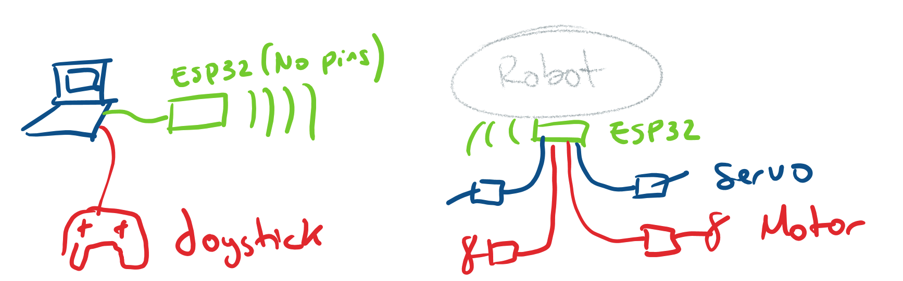

# BLIMP SWARM

BlimpSwarm is a framework to operate robots based on the ESP32 microcontroler.

### 0. Hardware setup

**Radio module:** an ESP32 connected to the base station (laptop) to act as radio communication module.
It runs the firmware in _examples/BaseTranseiver_.

**Robot:** Your robot should have a ESP32 with a robot firmware.
The firmware will depend on the type of robot:
* BicopterRaw: Send commands from the base stating to directly control two servos and two motors. No sensors or intermediate controller involved.
* Bicopter:
* 

### 1. Motor Calibration

