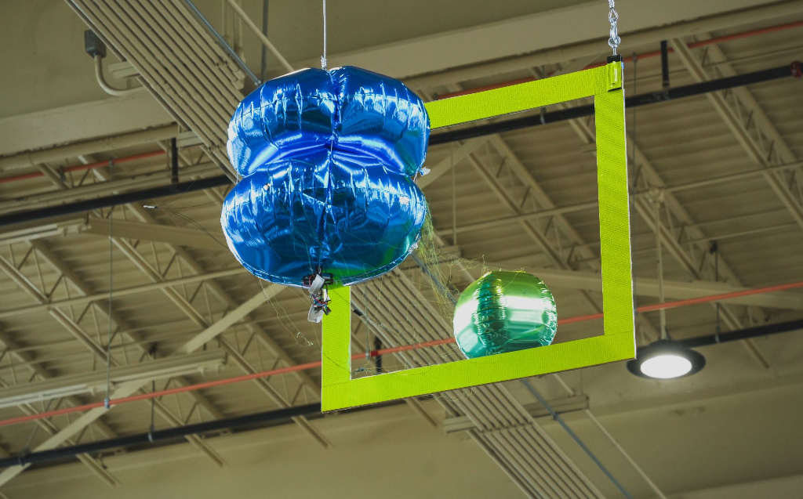

# Bicopter Blimp

## 0. Component list

The main components t build a bicopter that can be teleoperated are the following:

| **Component**                                                                                                                                          | **Quantity** | **Price** | **Total** |
|--------------------------------------------------------------------------------------------------------------------------------------------------------|--------------|-----------|-----------|
| [Brushless Motor](https://betafpv.com/products/1102-13500kv-brushless-motors?variant=40069450891398)                                                   | 2            | $10.00    | $20.00    |
| [Propeller](https://betafpv.com/products/gemfan-2015-2-blade-propellers-4pcs-1-5mm-shaft?variant=40024009506950)                                       | 2            | $0.63     | $1.25     |
| [Motor driver (ESC)](https://www.ebay.com/itm/285022527100?var=586851348993)                                                                           | 2            | $10.00    | $20.00    |
| [Micro servo](https://www.ebay.com/itm/233165296450)                                                                                                   | 1            | $3.50     | $3.50     |
| [Micro ESP32](https://us.seeedstudio.com/XIAO-ESP32S3-p-5627.html?queryID=b390fec8be23f6356e6cb35bff41f48c&objectID=5627&indexName=bazaar_us_products) | 1            | $6.50     | $6.50     |
| [Balloon](https://balloonsfast.com/36-ruby-red-foil-circle-balloon-1ct-12681.html)                                                                     | 1            | $4.00     | $4.00     |
| [Battery Kit: 5 Batteries + Charger](https://www.amazon.com/dp/B08XZNRTCP?psc=1&ref=ppx_yo2ov_dt_b_product_details)                                    | 1            | $19.00    | $19.00    |
| [Elastic](https://www.amazon.com/gp/product/B0B9BRFW4M/ref=ppx_yo_dt_b_search_asin_title?ie=UTF8&th=1)                                   | 1            | $9.49     | $9.49     |
|                                                                                                                                                        |              | Total     | $83.74    |

It is recommended to have a joystick and an USB hub

| **Component**                                                                                  | **Quantity** | **Price**         | **Total** |
|------------------------------------------------------------------------------------------------|--------------|-------------------|-----------|
| [XBox Joystick](https://www.amazon.com/dp/B08F4444HM?psc=1&ref=ppx_yo2ov_dt_b_product_details) | 1            | $27.00            | $27.00    |
| [USB Hub](https://www.amazon.com/dp/B07PY87TBD?psc=1&ref=ppx_yo2ov_dt_b_product_details)       | 1            | $13.00            | $13.00    |
| [USBC cable](https://www.amazon.com/dp/B0BXX6S2ZF?psc=1&ref=ppx_yo2ov_dt_b_product_details)    | 1            | $3.00             | $3.00     |
|                                                                                                |              | Total with extras | $43.00    |

Optionally, sensors can make the flight easier:

| **Component**                                                                                                                                                                                                                                                          | **Quantity** | **Price** | **Total** |
|------------------------------------------------------------------------------------------------------------------------------------------------------------------------------------------------------------------------------------------------------------------------|--------------|-----------|-----------|
| [Ultrasound sensor i2c](https://www.amazon.com/HiLetgo-GY-US42-Control-Ultrasonic-Distance/dp/B07QTHX93D/ref=sr_1_2?crid=2YZE2KUYTDXPZ&keywords=i2c+ultrasonic+sensor&qid=1706246132&sprefix=i2c+ultraso%2Caps%2C97&sr=8-2&qty=12)                                     | 1            | $11.50    | $11.50    |
| [Barometer BMP390 i2c](https://www.amazon.com/Geekstory-Precision-Barometric-Altimeter-Cable%EF%BC%88Pack/dp/B09CMJ9FJL/ref=sr_1_2_sspa?crid=RSRZF8IDE7ME&keywords=bmp390&qid=1706299407&sprefix=bmp390%2Caps%2C106&sr=8-2-spons&sp_csd=d2lkZ2V0TmFtZT1zcF9hdGY&psc=1) | 1            | $12.50    | $12.50    |
| [9DOF IMU i2c](https://www.adafruit.com/product/4754)                                                                                                                                                                                                                  | 1            | $25.00    | $25.00    |
|                                                                                                                                                                                                                                                                        |              | Total     | $49.00    |

## Assembling the robot
The instructions to assemble the robot are [here](
https://rhinestone-star-fa9.notion.site/Robot-Assembly-f31e5685cc46427f9f4b832dc4a56b95).

##
