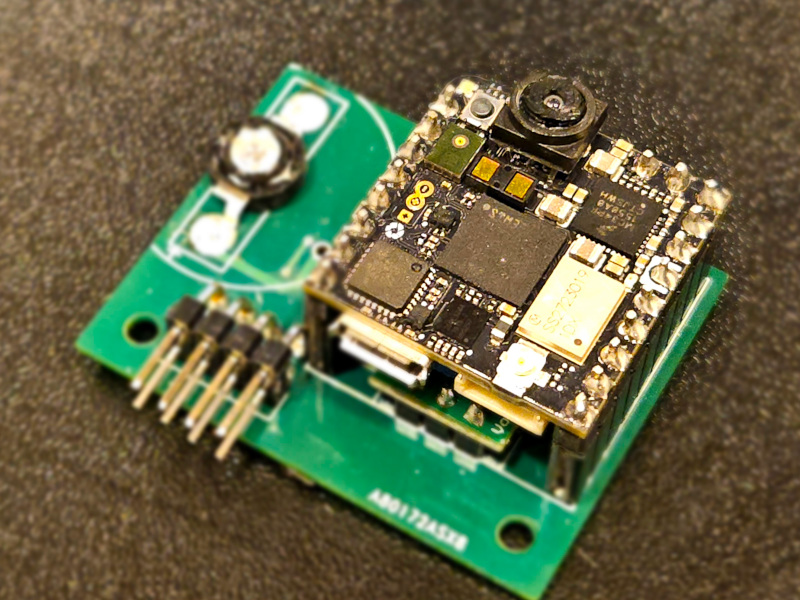

# Vision Module

## Hardware Requirements
For this tutorial, you need the _Arduino Nicla Vision_ and the _Vision Module_.

## Installation
1. Install _OpenMV IDE v4.1.5_ or latest from [here](https://openmv.io/pages/download)
2. Download/Clone the Gihub repository [Blob-Detection-and-Tracking](https://github.com/LehighBlimpGroup/Blob-detection-and-Tracking/blob/main/Blob%20Detection.py)

# Blob-detection-and-Tracking
Blob detection, tracking and serial communication to esp32 through IBus protocol using an OpenMV compatible edge camera device. Currently it has two modes:
1. Pure color-based blob detection and tracking, which requires a fine-tuned threshold in LAB space. Look at [OpenMV documentation on the function find_blobs](https://docs.openmv.io/library/omv.image.html#image.Image.find_blobs) for detailed reference.
2. IR blinking-based detection for retro-reflective surfaces using a IR-filter-free lens. The camera captures two consecutive images with LED off and on, respectively, then compute pixel-wise difference to highlight the reflective surfaces in the environment. Refer to [the initial tests on the reflective solution for more details](https://github.com/LehighBlimpGroup/Reflective_AimBot).
    1. Under colored mode (`isColored = True`), the algorithm distinguishes the reflective surfaces with different colors.
    2. Under grayscale mode (`isColored = False`), the algorithm does not distinguish the reflective surfaces with different colors.

Both modes use the same moving-window-based tracking methods (see classes `Tracking_ROI` and `TrackedBlob`).

## The logic flow of ROI tracking:
1. Initialize the ROI as the maximum size of the image.
2. Whenever a new detection is fed, find its bounding box.
3. New ROI is a weight average of the current rectangular ROI and the detection bounding box.

## The logic flow of the blob tracking:
1. Initialization:
    1. find a reference blob by constraining the minimum roundness, density, and of course color
    2. initialize a feature vector and a history list of blobs based on the reference
        1. *feature vector*: a vector of {five} values marking the **average** center x, y position, width, height, and blob direction of the tracked blob history
        2. *history*: a list of blobs that the algorithm considers as the same blob through multiple frames
2. Update: check the feature vector of the tracked blob against new detected blobs in terms of 1-norm/2-norm feature vector distance
    1. if the history list is full, pop the oldest, push the latest. Otherwise populate it.
    2. if the new blob feature vector is too far from the tracked blob, mark the tracked blob with an additional missed track
    3. if the tracked blob has too many missed tracks, reset the tracked blob history and feature vector, then go to step 1.ii.

## The logic flow of the retro-reflective detection:
1. IR LED off, take image1.
2. IR LED on (~2W power LEDs), take image2.
3. Compute pixel-wise difference between image1 and image2 by `diff = image2 - image1`.
4. (Optional) Filter out differences due to motion by finding high-frequency edges on image1 and use them as a `mask`.
5. Negate `diff` to recover the original color of the reflective surfaces.
6. Find colored blobs on `diff` with regions marked with `mask` masked out.

## Parameters
1. `thresholds`: it determines the color to detect and track
2. In function `find_reference`, `density_threshold` and `roundness_threshold=0.4`: they determine how strictly dense and round the initial blob needs to be.
3. In initialization of the `TrackedBlob` object currently in function `find_reference`,
    1. `norm_level` controls the distance type, 1-norm is faster and 2-norm is smoother (try both and feel the difference)
    2. `feature_dist_threshold` controls how strict a feature vector match needs to be
    3. `window_size` controls how long a history of tracked blobs the user wants to keep. Higher value gives a smoother but more draggy track
4. If the nicla is connected to another device through uart, when it receives `0x80`, it will try to switch to balloon tracking mode. When it receives `0x81`,
   it will try to switch to goal tracking mode.
5. In the initialization of `Tracking_ROI` objects, `forgetting_factor` controls how rapid the bounding box is updated with respect to a new input or a new misinput.

## Pending:
1. `id`: we would like to identify/distinguish different blobs.

## `Thresholds.txt`
We recorded the (manually-tuned) optimal color thresholds for balloon detection under different initial and ambient lighting consitions in this file.